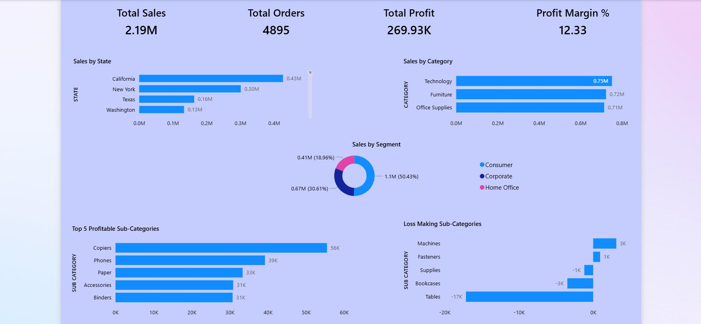
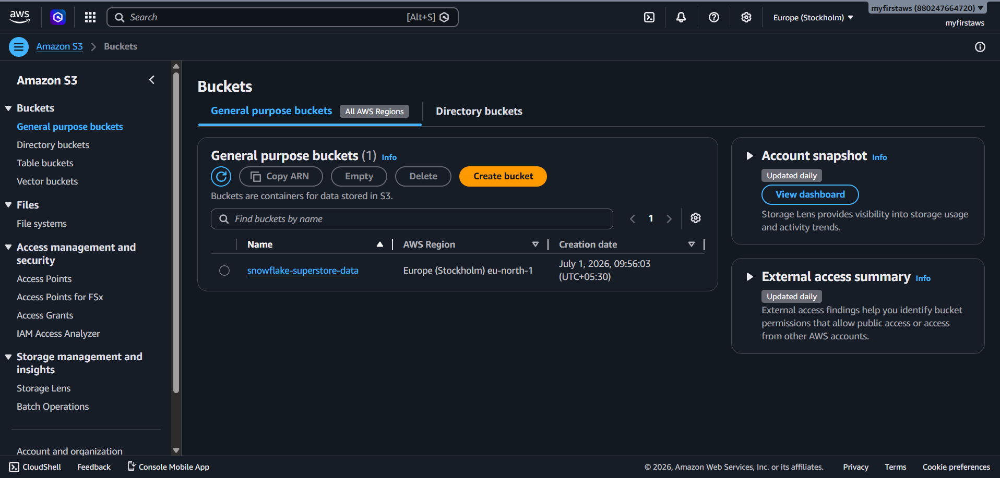
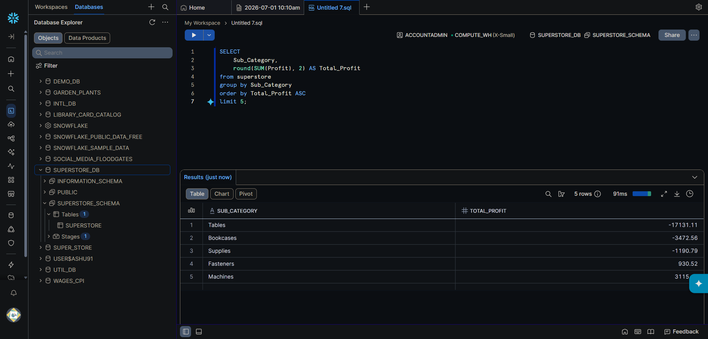

# Superstore Sales Analytics
### AWS S3 → Snowflake → Power BI


---

## What's this about

So I wanted to build something that actually looks like how data teams work in real companies — not just "load CSV, make chart." 

The idea was simple: store raw data in S3, load it into Snowflake, run SQL on it, and connect Power BI directly to the warehouse. No local databases, no shortcuts.

Took some IAM debugging to get there but it works end to end now.

---

## Architecture

```
Raw CSV
   │
   ▼
AWS S3  (snowflake-superstore-data bucket)
   │
   │  IAM Role + Storage Integration
   ▼
Snowflake  (SUPERSTORE_DB → superstore table, 9627 rows)
   │
   │  SQL Analysis + DirectQuery
   ▼
Power BI  (Executive dashboard)
```

---

## Dashboard



---

## Numbers that came out

| | |
|---|---|
| Total Orders | 4,895 |
| Total Sales | $2.19M |
| Total Profit | $269.93K |
| Profit Margin | 12.33% |

**By category:**

| Category | Sales | Profit |
|----------|-------|--------|
| Technology | $751K | $128K |
| Furniture | $722K | $19K |
| Office Supplies | $714K | $121K |

Furniture pulling in $722K in sales but only $19K profit — that's a problem worth digging into.

**Top states:**

California ($426K) → New York ($301K) → Texas ($162K) → Washington ($132K) → Pennsylvania ($113K)

**Sub-category breakdown:**

Winners: Copiers ($55K), Phones ($39K), Paper ($33K)

Losers: Tables (-$17K), Bookcases (-$3.4K), Supplies (-$1.1K)

Tables are actively losing money. Someone needs to have a conversation about Tables.

---

## How I built it

### 1. Dumped the CSV into S3

Created a bucket called `snowflake-superstore-data` and uploaded the Superstore dataset (2.2MB).



### 2. Set up Snowflake to talk to S3

This part took the longest. Had to create a storage integration, get Snowflake's IAM user ARN, set up a trust policy in AWS, create the IAM role, attach S3 read permissions — then come back to Snowflake and create the external stage.

```sql
CREATE OR REPLACE STORAGE INTEGRATION s3_superstore_integration
  TYPE = EXTERNAL_STAGE
  STORAGE_PROVIDER = 'S3'
  ENABLED = TRUE
  STORAGE_AWS_ROLE_ARN = 'arn:aws:iam::880247664720:role/snowflake-s3-role'
  STORAGE_ALLOWED_LOCATIONS = ('s3://snowflake-superstore-data/');
```

### 3. Created the stage and loaded data

```sql
CREATE OR REPLACE STAGE superstore_stage
  URL = 's3://snowflake-superstore-data/'
  STORAGE_INTEGRATION = s3_superstore_integration
  FILE_FORMAT = (TYPE = 'CSV' FIELD_OPTIONALLY_ENCLOSED_BY = '"' SKIP_HEADER = 1);

COPY INTO superstore
FROM @superstore_stage/
FILES = ('Sample - Superstore.csv')
FILE_FORMAT = (TYPE = 'CSV' FIELD_OPTIONALLY_ENCLOSED_BY = '"' SKIP_HEADER = 1)
ON_ERROR = 'CONTINUE';
```

9,627 rows loaded. 367 skipped due to UTF-8 encoding issues in some product names. Moving on.

### 4. Ran SQL analysis



Six queries covering total metrics, category breakdown, top states, segment split, and profitability. Full file here → [`superstore_analysis.sql`](superstore_analysis.sql)

### 5. Connected Power BI via DirectQuery

Plugged Power BI straight into Snowflake using DirectQuery — so it's hitting the warehouse live, not a static import. Added one DAX measure:

```dax
Profit Margin% = ROUND(SUM(SUPERSTORE[PROFIT]) / SUM(SUPERSTORE[SALES]) * 100, 2)
```

Built the dashboard from there.

---

## Stack

| | |
|---|---|
| AWS S3 | Raw data storage |
| AWS IAM | Cross-service auth |
| Snowflake | Cloud warehouse + SQL |
| Power BI | Dashboard + DirectQuery |

---

## Files

```
├── superstore_analysis.sql            # Setup + all 6 analysis queries
├── Superstore_Snowflake_Dashboard.pbix
├── dashboard_preview.png
├── snowflake_queries..png
├── s3_bucket.png
└── README.md
```

---

## What I Learned

- AWS IAM doesn't trust anyone by default — had to literally write a custom policy to convince it that Snowflake is a friend, not a threat.
- `COPY INTO` loaded 9,627 rows, skipped 367, said "PARTIALLY_LOADED" and didn't even apologize. Turns out some product names had weird UTF-8 characters. Fair enough.
- DirectQuery sounds cool until Power BI wakes up and asks for your Snowflake credentials again. Every. Single. Session.
- Spent more time setting up the S3 → Snowflake integration than actually analyzing the data. That's just how pipelines work I guess.
- Snowflake external stages are basically a bouncer at a club — S3 won't let anyone in without the right IAM role and a trust policy as ID.
- Moving data from S3 to Snowflake to Power BI through IAM roles, storage integrations, and external stages — apparently that's just a Tuesday in data engineering.

---

**Ashutosh Saini**

[](https://linkedin.com/in/ashutosh-flow)
[](https://github.com/InsightsByAsh)
